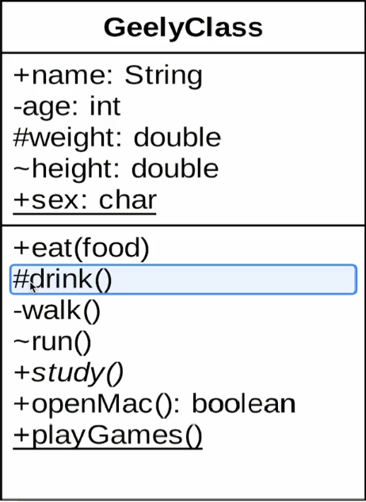
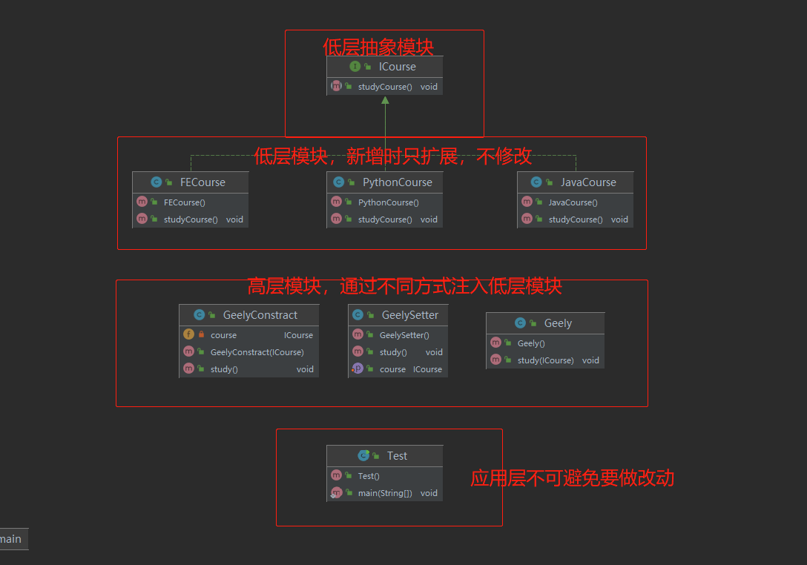

### 设计模式辅助学习资料

> 实战工程能力

- https://coding.imooc.com/class/96.html
- https://coding.imooc.com/class/162.html

> Geely主页

- https://www.imooc/com/t/2705746

### 类图

- 子 指向 父

- 实线：继承   **关联**对象   一个类作为另一个类的属性

- 虚线：实现   **依赖**关系   方法入参，临时用一下    
- 空心菱形：**聚合**   整体和局部的关系，拥有独立的生命周期，大雁群<空心> --> 大雁 ，has a 的关系
- 实心菱形：**组合**   整体和局部的关系，拥有相同的生命周期，大雁<实心>1-->2 翅膀 ，contains a 的关系

三部分：

- 类名；抽象类斜体表示；  如果是接口，则<interface>
- 成员变量：+ public - private # protected ~ 默认包权限 _ static的
- 成员方法：同理  抽象是斜体

### 时序图

### 开闭原则

> 对扩展开放，对修改关闭
>
> 用抽象构建框架，用实现扩展细节

### 依赖倒置原则

> 高层模块不应该依赖低层模块，二者都应该依赖其抽象
>
> 细节应该依赖抽象
>
> 针对接口编程，而不是针对实现编程

> 优点：
>
> 可以减少类之间的耦合性，提高系统稳定性，提高代码可读性和可维护性，可降低修改程序造成的风险

**相对于细节得多变性，抽象更加稳定，以抽象为基础搭建起来的架构，比以细节为基础搭建起的架构稳定的多；抽象的目的就是制定好规范和契约，如ICourse，只制定好学习，具体的学习课程由子类去实现；而高层模块Geely是不依赖于具体的课程的实现**

